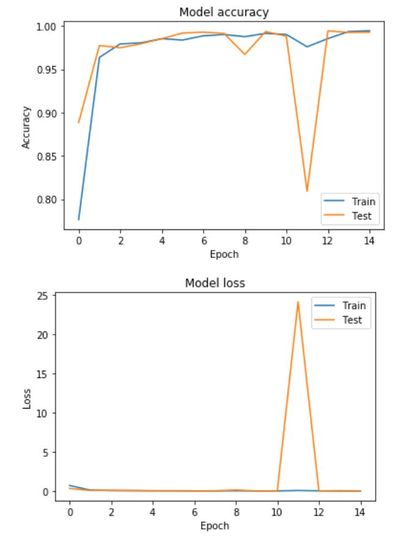
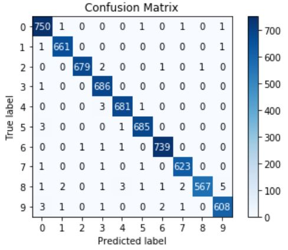
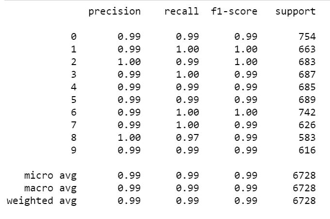
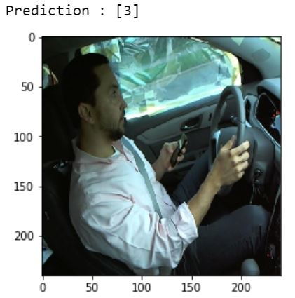

# Distracted Driver MultiAction Classification

**Data set** : https://www.kaggle.com/c/state-farm-distracted-driver-detection

**Objective** : Classify images into these 10 classes 
  - c0: safe driving
  - c1: texting - right
  - c2: talking on the phone - right
  - c3: texting - left
  - c4: talking on the phone - left
  - c5: operating the radio
  - c6: drinking
  - c7: reaching behind
  - c8: hair and makeup
  - c9: talking to passenger

**Programming Language** : Python using TensorFlow 2.0 & Keras
  
**Model Architecture** : Deep Learning using CNN
  
**About Data Set** 
The Data set is images of different people in a driver seat doing different things. Data set already divided into Train and Test by folders.
1. Train Data - Has Classes as subfolders and each subfolder has images of only corresponding Class  
2. Test Data - Has images of the all classes 

*All the images are of 640x240 resolution*

**Data Pre-Processing**
In order to build a Classification model we have to read and convert the images to a numerical array type data.

*Read Train Data*
```python
# creating a training dataset.
training_data = []
i = 0
def create_training_data():
    for category in classes:
        path = os.path.join(directory,category)
        class_num = classes.index(category)
        
        for img in os.listdir(path):
            img_array = cv2.imread(os.path.join(path,img),cv2.IMREAD_COLOR)
            RGB_img = cv2.cvtColor(img_array, cv2.COLOR_BGR2RGB)
            new_img = cv2.resize(RGB_img,(img_size,img_size))
            training_data.append([new_img,class_num])

create_training_data()
```

*Reading the Training images that are in the folders of each class*
1. Declare an empty list Object where we will store the image array and the Class Label
2. loop through each Class folder and Store the Class Label 
3. loop through each image in the folder
4. Read the Image
5. Resize the Image to 240x240
6. Add the Image and Class Label data to the Training Data list


*Seperate the feature(Image Data) and its labels(Class Label)*
```python
x = [], y = []
for features, label in training_data:
    x.append(features)
    y.append(label)
```

*Convert the Class Labes to Categorical values(I used Keras utils)*
```python
Y_train = utils.to_categorical(y_train,num_classes=10)
Y_test = utils.to_categorical(y_test,num_classes=10)
```

**Model Building** 

Implemented in TensorFlow 2.0 using Keras as high level api. Architecture used is Convolutional Neural Network(CNN)

*CNN Model* : The model has 3 CNN Layers,Flattening layer and Fully connected Dense Layers

Each Layer has
  - 2 Conv2D layers (first layer with input of shape 240,240,3 (240x240 - Image Scale, 3 - RGB Scale))
  - 2 BatchNormalization layers [For Info click here](https://medium.com/deeper-learning/glossary-of-deep-learning-batch-normalisation-8266dcd2fa82)
  - 1 Dropout Layer of rate 30% 
  
*Model Compilattion with loss='categorical_crossentropy',metrics='accuracy' and optimizer='adam'*

*Call back for early stopping when test accuracy doesn't increase in 5 epochs*
```python
callback = [callbacks.EarlyStopping(monitor='val_accuracy',patience=5)]
```
**Model Performance Review**

*Model training vs validation accuracy and loss trend for each epoch*



*Plot Confusion Matrix to check if there are any imbalences in Validation Class prediction*

From the report it doen't look like there are any considerable imbalance classes for the model



*Classification Report to check Precision, Recall and F1 Score*

The Model Seem to performing well with score of 99%



**Random Validation on Test Data**

1. Get a file name of image from Test folder 
```python
random_filename = random.choice([
    x for x in os.listdir(test_directory)
    if os.path.isfile(os.path.join(test_directory, x))])
random_filename=test_directory+random_filename
```
2. Read and Resize the image
```python
img_array = cv2.imread(random_filename,cv2.IMREAD_COLOR)
RGB_img = cv2.cvtColor(img_array, cv2.COLOR_BGR2RGB)
new_img = cv2.resize(RGB_img,(img_size,img_size))
```
3. Predict and Display the image 
```python
print('Prediction : {}'.format(model.predict_classes(new_img.reshape(-1,img_size,img_size,3))))
plt.imshow(new_img)
plt.show()
```


**Save the Model & Weights**

Saving the model and the weights for transfer learning or model execution later

```python
model.save_weights('./driverdistraction_lr_weights.h5', overwrite=True)
model.save('./driverdistraction.h5')
```
